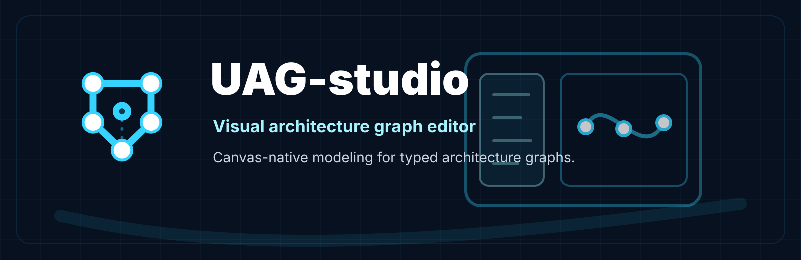

<p align="center">
  
</p>

# UAG-studio

React and Rust visual architecture graph editor for creating, validating, and exporting UAG projects.

## Purpose
UAG Studio is the user-facing editor. It lets users design architecture visually while saving typed graph data.

## Stack
- React
- TypeScript
- React Flow
- Vite
- Tauri
- Rust
- UAG-core
- UAG-compiler

## Native Editing Format
Studio edits TAKG. UAGL is compiled output and may be opened read-only or imported.

## UI Areas
- Project explorer
- Node palette
- Relationship palette
- Graph canvas
- Property inspector
- View manager
- Compiler panel
- Diagnostics panel
- Validation panel
- Export panel
- Loss report panel
- Search panel

## Workflow
```text
create/open project
→ edit graph visually
→ save TAKG
→ compile to UAGL
→ display diagnostics/loss reports
→ export artifacts
```
